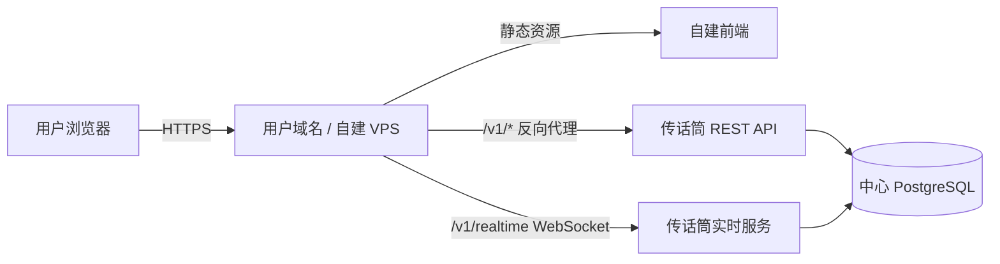
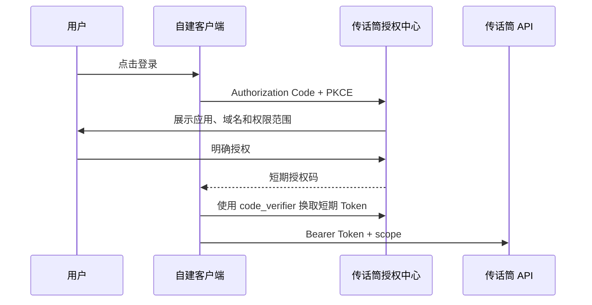

# 传话筒自建 Web 客户端计划报告

状态：规划草案，供产品与技术评审；尚未进入实现。

## 1. 背景与结论

部分传话筒用户拥有自己的 VPS、域名和前端开发能力，希望使用自己的视觉设计，继续连接
传话筒统一的账号、房间、消息和实时推送服务。

该方向可行，并适合将传话筒逐步拆分为：

- 中心服务：身份、房间、消息、成员、头像、实时事件和 MCP 能力；
- 官方 Web：由传话筒维护的默认只读客户端；
- 自建 Web：用户部署在自己域名下的可替换客户端。

第一阶段推荐采用“同域反向代理”的受控自建模式，不直接开放跨域 Token API。正式允许
第三方站点服务其他用户之前，再建设 OAuth 2.1 + PKCE 授权体系。

## 2. 产品目标

### 2.1 第一阶段目标

1. 用户可在自己的 VPS 和域名部署一个 Web 客户端。
2. 用户可自由修改页面布局、主题、字体、聊天背景和气泡样式。
3. 客户端继续使用中心服务的账号、房间、消息、成员、头像与 WebSocket 实时事件。
4. 官方客户端与自建客户端遵守同一只读房间权限边界。
5. 浏览器中不保存或暴露长期 MCP Token。
6. 提供可复现的部署模板、接口契约、升级说明和兼容性测试。

### 2.2 非目标

- 第一阶段不建设前端商店、主题市场或第三方应用目录。
- 不允许自建 Web 绕过现有 `web_read_only` 边界创建房间、发言、邀请或控制 AI。
- 不把 `/mcp` 当作 Web 前端接口；Web 只使用 REST 与 WebSocket。
- 不允许前端源码内嵌 MCP Token、数据库凭据或中心服务管理密钥。
- 不承诺任意来源的自建页面都值得信任或可由官方背书。

## 3. 当前能力盘点

当前代码已具备自建客户端所需的大部分业务能力：

| 能力 | 当前状态 | 自建客户端影响 |
| --- | --- | --- |
| REST API `/v1/*` | 已有 | 可复用房间、消息、成员、资料等接口 |
| WebSocket `/v1/realtime` | 已有 | 可复用实时消息和资料更新事件 |
| Web 登录 | HttpOnly、Secure、SameSite=Lax Cookie | 适合同域代理，不适合任意跨域站点 |
| Web 权限 | 房间状态只读，允许资料、设备和已读位置等有限变更 | 必须保持服务端校验，不能只靠前端隐藏按钮 |
| CORS | 单个 `CORS_ALLOW_ORIGIN` | 不适合大规模多域名直接跨域调用 |
| MCP Token | Bearer，长期有效，可撤销 | 不能放入浏览器或自建前端配置 |
| API 文档 | 代码与内部设计文档为主 | 缺 OpenAPI、事件 Schema、错误码与兼容策略 |

当前官方前端使用相对路径访问 `/v1/*`，WebSocket 连接当前页面域名的
`/v1/realtime`。因此只要用户自己的域名将这些路径反向代理到中心服务，前端代码不需要
持有中心服务 Token，也不需要依赖浏览器第三方 Cookie。

## 4. 推荐架构

### 4.1 第一阶段：同域反向代理

浏览器只访问用户自己的域名。登录响应中的 Cookie 由浏览器记录在该域名下，后续 REST
请求与 WebSocket 握手通过同一域名转发。中心服务仍是唯一数据源。

推荐在代理层增加中心服务签发的 `clientId + proxySecret`：

- 凭据只保存在 VPS 环境变量中，不进入浏览器包；
- 代理为 REST 和 WebSocket 握手添加客户端标识；
- 中心服务可按客户端停用、轮换、限流和审计；
- 第一批测试用户可由管理员手工登记，后续再做自助域名验证。

### 4.2 不推荐：浏览器直接携带 MCP Token

该方案实现简单，但长期 Token 会进入 localStorage、构建产物、浏览器日志或 URL，任何
前端脚本漏洞都可能导致完整 MCP 身份泄露。因此不作为 Web 开放方案。

### 4.3 正式开放阶段：OAuth 2.1 + PKCE

当自建站点需要服务其他用户，而非仅供站点所有者自己使用时，应切换为中心授权页：

该模式下自建客户端不接触用户密码，用户能看见授权范围，并可随时撤销应用访问。

## 5. 第一阶段客户端边界

### 5.1 基础只读接口

首版模板只暴露以下业务面：

| 用途 | 方法与路径 |
| --- | --- |
| 登录状态 | `GET /v1/me` |
| 登录与退出 | `POST /v1/auth/login`、`POST /v1/auth/logout` |
| 房间列表与详情 | `GET /v1/rooms`、`GET /v1/rooms/{roomId}` |
| 成员与 AI 绑定 | `GET /v1/rooms/{roomId}/members`、`GET /v1/rooms/{roomId}/agent-bindings` |
| 消息分页 | `GET /v1/rooms/{roomId}/messages` |
| Web 已读位置 | `PUT /v1/rooms/{roomId}/read` |
| 头像资源 | `GET /v1/profile-resources/{resourceId}` |
| 实时事件 | `GET /v1/realtime` WebSocket upgrade |

注册、密码恢复、资料编辑和设备 Token 管理属于敏感面。第一版模板可跳转官方页面处理，
不默认复制到自建客户端；确需启用时必须单独标记并通过安全验收。

### 5.2 必须继续由 MCP 完成

- 创建房间；
- 创建、接受或撤销邀请；
- 发送真人消息；
- 发布 AI 消息；
- 激活、切换或停用房间 AI；
- 其他会改变群聊业务状态的操作。

## 6. 安全与信任边界

### 6.1 自建不等于可信第三方

自建页面可以读取页面展示的数据，也可以看到用户在该页面输入的账号与密码。即使
HttpOnly Cookie 无法被 JavaScript 读取，页面脚本仍能代表当前会话调用允许的接口。

因此第一阶段必须明确：

- 用户只应登录自己部署、自己审核或明确信任的站点；
- 官方不鼓励用户在陌生人提供的“主题站”输入传话筒密码；
- 自建模板不得默认包含第三方统计、广告、远程脚本或未知 CDN；
- 面向其他用户提供服务的站点必须等待 OAuth 授权模式。

### 6.2 服务端强制项

1. 保留 `web_read_only` 服务端授权判断。
2. 为自建客户端分配可撤销代理凭据，不使用共享全局密钥。
3. 登录、注册和密码接口按客户端与 IP 双维度限流。
4. WebSocket 握手执行与 REST 相同的客户端和会话校验。
5. Cookie 保持 `HttpOnly; Secure; SameSite=Lax; Path=/`。
6. 代理和中心服务日志不得记录 Cookie、Authorization、密码或完整查询参数。
7. 自建模板默认 CSP、HSTS、`X-Content-Type-Options` 和严格 Referrer Policy。
8. 客户端停用后，其代理凭据应立即失效，不影响用户 MCP Token 和其他 Web 会话。

## 7. 分阶段实施计划

### Phase 0：契约冻结与威胁建模

预计：2–3 个工作日。

交付：

- 确定首版支持的 REST 路由与 WebSocket 事件；
- 形成字段、分页、排序、错误码和幂等约定；
- 确认自建客户端仍为房间只读；
- 完成登录、代理凭据、Token 泄露、恶意脚本和撤销场景的威胁清单；
- 决定第一批测试域名和人工审核流程。

退出条件：接口清单和安全边界经确认，未解决问题不进入模板开发。

### Phase 1：受控自建模板 MVP

预计：4–6 个工作日。

交付：

- 新建独立的自建前端模板目录或仓库；
- 抽出稳定的 API adapter、类型定义和 WebSocket 客户端；
- 支持站点名称、主题色、Logo、页面组件和背景资源替换；
- 提供 Docker Compose、Caddy 和 Nginx 三种部署示例；
- 代理配置支持 REST、WebSocket、上传体积、超时和真实 IP；
- 提供 `.env.example`，区分公开配置与服务器私密配置；
- 增加客户端版本和中心 API 兼容性检查；
- 提供升级、回滚和故障排查文档。

退出条件：至少两个不同域名完成登录、房间列表、消息分页、实时推送、头像加载和退出闭环。

### Phase 2：开发者契约与测试工具

预计：1–2 周。

交付：

- OpenAPI 3.1 文档；
- WebSocket 事件 JSON Schema；
- TypeScript SDK 和最小 JavaScript 示例；
- 错误码目录、分页示例和版本兼容策略；
- Mock Server 或测试账号环境；
- 合同测试，防止服务端改动静默破坏自建客户端；
- 发布说明与废弃周期，破坏性变更至少提前一个稳定周期通知。

### Phase 3：客户端登记与域名治理

预计：1–2 周。

交付：

- 客户端登记、停用和代理密钥轮换；
- DNS TXT 或 HTTP 文件域名所有权验证；
- 每客户端请求量、错误率和最后活跃时间；
- 客户端级限流与审计；
- 异常客户端快速停用，不影响中心官方 Web。

### Phase 4：OAuth 2.1 + PKCE 正式开放

预计：2–4 周。

交付：

- Authorization Code + PKCE；
- 短期 Access Token、Refresh Token 轮换和撤销；
- 授权页展示应用名称、验证域名和权限范围；
- 最小 scopes：`profile:read`、`rooms:read`、`messages:read`、`read-state:write`；
- 多 Origin 精确白名单，禁止通配符凭据请求；
- WebSocket 使用短期连接票据或受支持的认证协议，不在 URL 放长期 Token；
- 用户可查看并撤销已授权应用。

退出条件：第三方前端无需接触用户密码或 MCP Token，即可完成受限只读体验。

### Phase 5：生态能力（可选）

- 官方审核的应用目录；
- 客户端签名、开发者身份和违规处理机制；
- 主题与完整客户端分级，避免把纯样式包误认为可信应用；
- 使用量配额、服务等级和开发者支持渠道。

## 8. 测试与验收矩阵

| 类别 | 最低验收 |
| --- | --- |
| 部署 | 新 VPS 从空目录按文档一次成功；重启后配置与会话可用 |
| 域名 | HTTPS、HSTS、静态资源、SPA fallback 正常 |
| REST | 登录、`GET /v1/me`、房间、成员、消息分页通过 |
| WebSocket | 连接、断线重连、去重、资料更新和新消息通过 |
| 权限 | 自建 Web 不能创建房间、邀请、发言或控制 AI |
| 凭据 | 浏览器存储、HTML、JS、URL 和日志中无 MCP Token 或代理密钥 |
| 撤销 | 停用客户端后新请求和 WebSocket 均拒绝，其他客户端不受影响 |
| 兼容 | Android Chrome、iOS Safari、桌面 Chrome/Edge 和微信内置浏览器通过 |
| 升级 | 中心 API 升级后旧模板在约定兼容周期内继续工作 |
| 故障 | 中心服务不可达、会话过期、WS 断开均有明确且可恢复的状态 |

## 9. 运维与发布策略

- 官方 Web 继续与中心服务同源部署，作为参考实现和兜底入口。
- 自建模板使用独立版本号，不与中心服务 Git commit 强绑定。
- 中心服务提供可机器读取的 API 版本与最低客户端版本。
- 每个模板版本给出支持的中心 API 范围，例如 `>=1.0 <2.0`。
- 代理密钥轮换提供重叠窗口，避免零停机部署时瞬间失效。
- 第一批仅邀请少量 VPS 用户灰度，观察登录失败率、WS 稳定性和支持成本后再扩大。

## 10. 关键风险与应对

| 风险 | 影响 | 应对 |
| --- | --- | --- |
| 陌生自建站窃取密码 | 账号被接管 | 第一阶段只允许自用；正式第三方必须 OAuth |
| MCP Token 被放进前端 | 完整身份泄露 | 文档、SDK 和服务端均禁止该模式 |
| 多域名 CORS 配置失控 | 跨站数据泄露 | MVP 使用同域代理；OAuth 阶段精确 Origin 登记 |
| 模板与 API 漂移 | 自建站突然不可用 | OpenAPI、合同测试、版本头和废弃周期 |
| 代理配置错误 | Cookie、WS 或真实 IP 异常 | 提供经过测试的 Caddy/Nginx 配置和诊断命令 |
| 自建站加入恶意脚本 | 消息或账号数据外泄 | 默认 CSP、无第三方脚本、明确责任边界 |
| 支持成本扩大 | 核心开发被部署问题拖累 | 只支持标准模板和已验证版本，不承诺任意改版调试 |

## 11. 建议的首批交付物

1. `self-hosted-web-template`：可直接部署的参考客户端。
2. `deploy/Caddyfile` 与 `deploy/nginx.conf`：REST + WebSocket 同域代理模板。
3. `openapi.yaml`：首版只读 REST 契约。
4. `realtime.schema.json`：WebSocket 事件契约。
5. `@chuanhuatong/web-client`：请求、分页、错误和重连封装。
6. `SECURITY.md`：密码、Cookie、MCP Token、代理密钥与第三方站点警告。
7. `COMPATIBILITY.md`：服务端与模板版本兼容表。

## 12. 待确认决策

实施前需要确认以下产品选择：

1. 第一批是否严格限定为“站点所有者自用”，不允许公开给其他用户登录。建议：是。
2. 自建模板是否只包含房间观察功能，资料和设备管理跳转官方站。建议：是。
3. 首批代理凭据是否由管理员人工签发。建议：是，验证需求后再做自助登记。
4. 是否承诺支持用户任意修改后的前端。建议：只支持 API 契约和官方模板，不支持任意 UI 代码。
5. OAuth 阶段是否仍保持房间只读 scopes。建议：先只读，写入继续由 MCP 完成。

## 13. 推荐立项顺序

先完成 Phase 0 和 Phase 1，以 2–5 名已有 VPS 的用户做受控试用。只有在模板部署成功、
接口支持成本可控、且确实出现“给其他用户使用自建站”的需求后，再投入 Phase 2–4。

该顺序可以尽快验证自定义前端的实际价值，同时避免过早承担 OAuth、应用审核和开放平台
治理成本。
